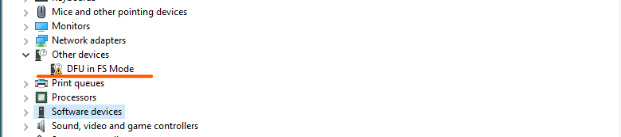
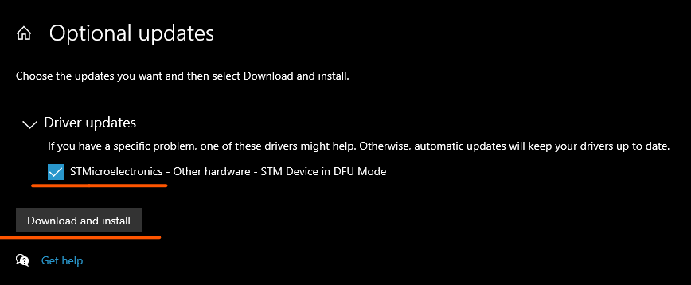
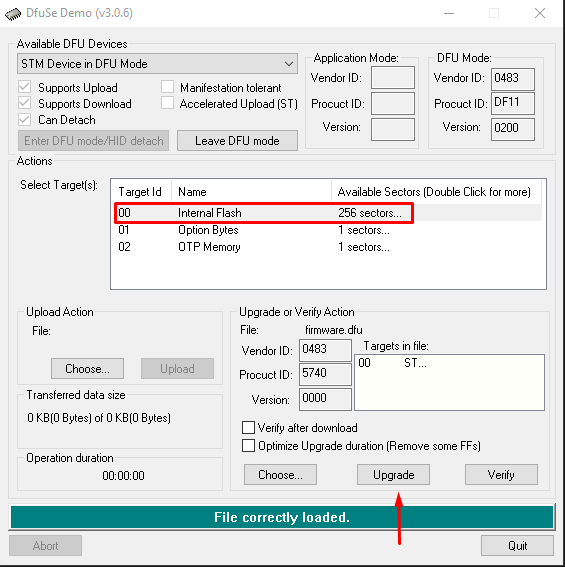

## Installing dfu-util

`dfu-util` is currently required to flash Flipper Zero firmware via USB-C port.

You can skip this part if you have `dfu-util` installed.

### Windows

#### Preperation

To flash Flipper in Windows we need `DfuSeDemo` software and firmware in `*.dfu` format. 

Download actual firmware [here](https://update.flipperzero.one/master/firmware/firmware.dfu).
You can get DfuSeDemo from official [site](https://www.st.com/en/development-tools/stsw-stm32080.html).
It’s completely free, you just need to register during downloading process.

#### Flashing

On Flipper enter in DFU mode and connect to PC.
As you can see our Flipper One named as `DFU in FS Mode` and wee need to install compatible driver.


Go to Windows Update Centre -> View optional updates.


Find `STMicroelectronics` in driver updates, mark it and press “Download and install”.


Check in Device Manager that name of the device has already changed to «STM Device in DFU Mode».
In some cases, reboot is required.


Now it’s time to install and run DfuSeDemo.
You can select our device `STM Device in DFU Mode` in top section of the app. 
After that choose `00  Internal Flash  256 sectors…` section in targets table.
Next click `Choose` in the bottom of the window and find firmware file.


After all preperations press Upgrade and click “Yes” in pop-up window.


Reboot Flipper after successful upgrade. Done!


### macOS

Install [Homebrew](https://brew.sh) if you don't have it:
``` sh
/bin/bash -c "$(curl -fsSL https://raw.githubusercontent.com/Homebrew/install/HEAD/install.sh)"
```

Install `dfu-util`:
``` sh
brew install dfu-util
```

### Linux

Choose your distro to install from the package manager or [build from sources](http://dfu-util.sourceforge.net/build.html).

=== "Ubuntu/Debian"
    ``` sh
    sudo apt-get install dfu-util
    ```
=== "Fedora"
    ``` sh
    sudo yum install dfu-util
    ```
=== "Arch"
    ``` sh
    sudo pacman -Sy dfu-util
    ```

## Flashing firmware

### Download latest firmware build

Click the image to download latest build of full firmware:
[{: width="400"}](https://update.flipperzero.one/full_firmware_latest.bin)

### Enter DFU Mode

DFU means Device Firmware Update.

{{ gif("/assets/how-to-dfu.mp4") }}

To enter DFU Mode:

1. Press and hold :flp-btn-left: + :flp-btn-back:, just like for reboot, then wait a second
2. Release :flp-btn-back:, but keep holding :flp-btn-left: for one more second
3. Release :flp-btn-left:

The display should turn off, and the LED lights up in blue color, meaning you are in DFU Mode.

Connect your Flipper Zero to the PC over USB.

### Upload firmware

Run this command in the terminal to upload new firmware:
``` sh
dfu-util -a 0 -s 0x08000000 -D full_firmware_latest.bin
```

!!! warning
    If you download the firmware from the link above, you will get a bundled binary, which consists of bootloader and firmware itself.

    However, if you're trying to flash the firmware **without bootloader**, you must use `0x08008000` in `-s` parameter of `dfu-util`. You don't need this normally.

### Boot back

After flashing the firmware, [reboot](rebooting.md) to exit DFU mode.

The USB cable can be unplugged before or after rebooting.
