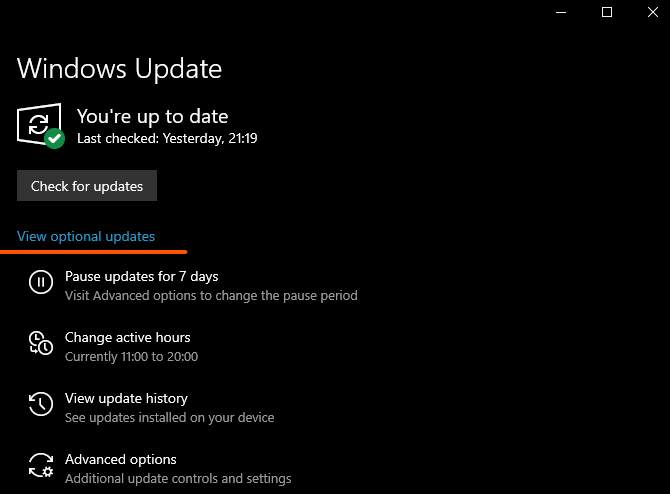
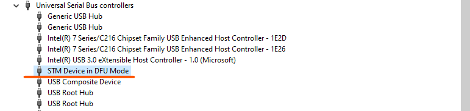

## Download latest firmware

Click the image to download latest build of full firmware:
[{: width="400"}](https://update.flipperzero.one/release/full.dfu)

## Enter DFU Mode

DFU means Device Firmware Update.

{{ gif("assets/how-to-dfu.mp4") }}

To enter DFU Mode:

1. Press and hold :flp-btn-left: + :flp-btn-back:, just like for reboot, then wait a second
2. Release :flp-btn-back:, but keep holding :flp-btn-left: for one more second
3. Release :flp-btn-left:

The display should turn off, and the LED lights up in blue color, meaning you are in DFU Mode.

Connect your Flipper Zero to the PC over USB.

## Flash in Windows

### Fix drivers

This step has to be done just once.

As you can see, our Flipper Zero appeared as `DFU in FS Mode`, and we need to install a compatible driver.


Go to Windows Update Centre -> View optional updates.



Find `STMicroelectronics` in driver updates, select it and press `Download and install`.


Check that the name of the device in Device Manager has changed to `STM Device in DFU Mode`.
In some cases, PC reboot is required.



### Install DfuSeDemo

This step has to be done just once.

[DfuSeDemo](https://www.st.com/en/development-tools/stsw-stm32080.html) is required to flash Flipper Zero in Windows.

Click the link, download it for free and install.

The website will ask you to register to download the software, that's okay.

### Flashing

Launch DfuSeDemo and select `STM Device in DFU Mode` in the top section of the app. 

After that, choose `00  Internal Flash  256 sectors…` section in targets table.

Next, click `Choose` in the bottom of the window and select the firmware file you downloaded on the first step.


Press Upgrade and click “Yes” in pop-up window.


[Reboot](rebooting.md) Flipper Zero after successful upgrade.

## Flash in macOS/Linux

### Install dfu-util

`dfu-util` is currently required to flash Flipper Zero firmware via USB-C port.

You can skip this part if you have `dfu-util` installed.

=== "macOS"
    Install [Homebrew](https://brew.sh) if you don't have it:
    ``` sh
    /bin/bash -c "$(curl -fsSL https://raw.githubusercontent.com/Homebrew/install/HEAD/install.sh)"
    ```

    Install `dfu-util`:
    ``` sh
    brew install dfu-util
    ```
=== "Ubuntu/Debian"
    ``` sh
    sudo apt-get install dfu-util
    ```
=== "Fedora"
    ``` sh
    sudo yum install dfu-util
    ```
=== "Arch"
    ``` sh
    sudo pacman -Sy dfu-util
    ```
=== "Linux Sources"
    You can always [build dfu-util from sources](http://dfu-util.sourceforge.net/build.html).

### Upload firmware

Run this command in the terminal to upload new firmware:
``` sh
dfu-util -a 0 -D full.dfu
```

After flashing the firmware, [reboot](rebooting.md) to exit DFU mode.

The USB cable can be unplugged before or after rebooting.
